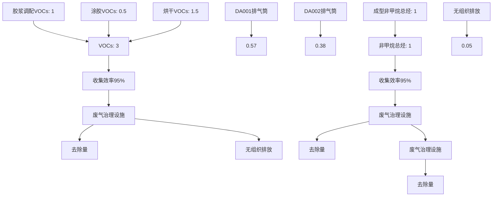
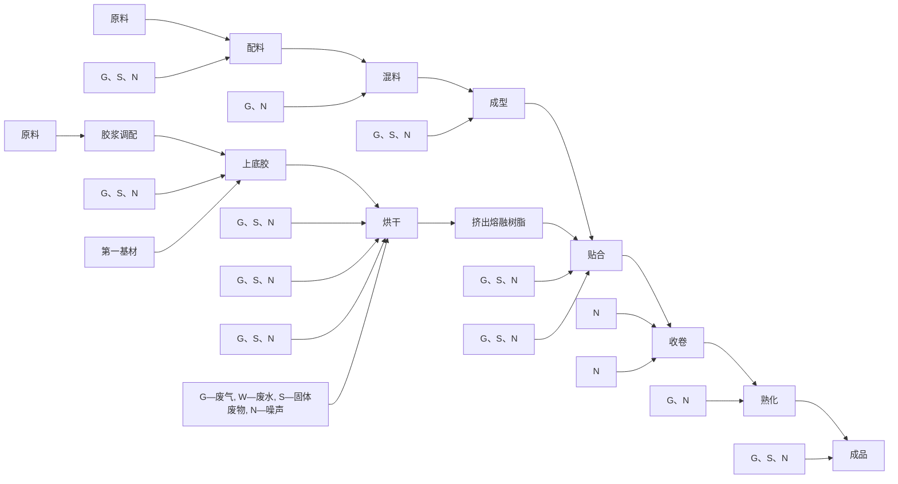
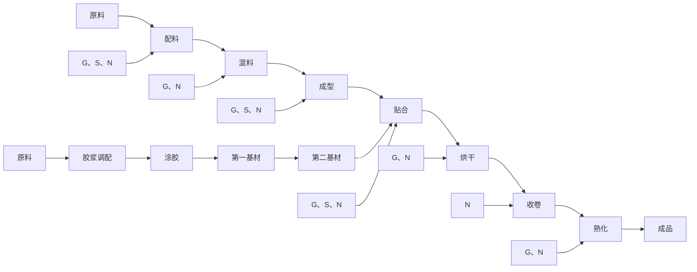
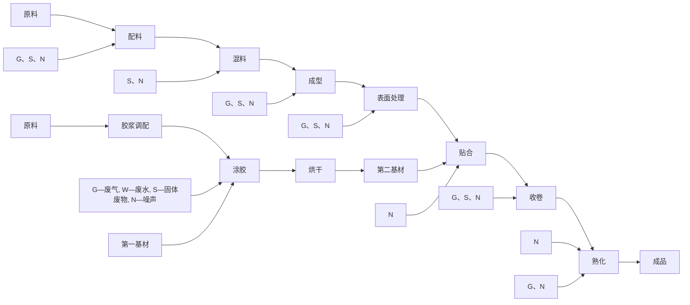
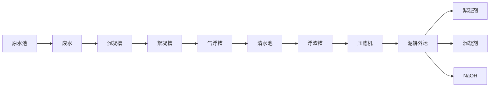
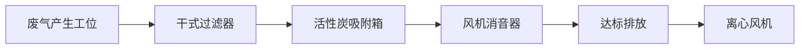
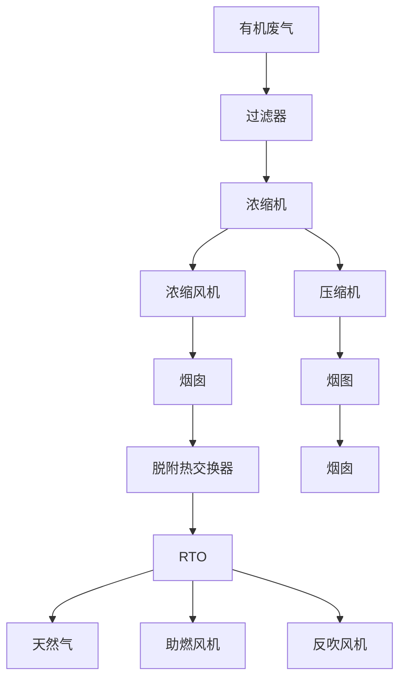

# 佛山市塑胶行业

# 建设项目环评文件编制技术参考指南（试行）

组织编制单位：佛山市生态环境局高明分局组织编制时间：二〇二二年八月

## 目录一、适用范围二、编制依据三、总体要求.
四、具体编制要求
（一）建设项目基本情况
（二）建设项目工程分析.
（三）区域环境质量现状、环境保护目标及评价标准

（四）主要环境影响和保护措施 （五）环境保护措施监督检查清单 （六）结论.
（七）附表
（八）附图附件一：VOCs 含量限值附件二：废气污染治理措施附件三：废气风量核算方法附件四：佛山市重点行业VOCs 治理设施运维管理指引附件五：《塑料包装印刷挥发性有机物治理实用手册》过程控制要求

## 一、适用范围本指南主要适用于指导佛山市塑胶制造业涉使用胶水建设项目环境影响报告表的编制及环境影响报告书有关内容的编制。

## 二、编制依据本参考指南编制的主要依据及参考文献如下：

环办环评〔2020〕33号关于印发《建设项目环境影响报告表》内容、格式及编制技术指南的通知；

HJ884污染源源强核算技术指南准则；

HJ942排污许可证申请与核发技术规范总则；

HJ1122排污许可证申请与核发技术规范橡胶和塑料制品工业；

HJ819排污单位自行监测技术指南总则；

HJ1207排污单位自行监测技术指南橡胶和塑料制品；

环保部公告2013第31号挥发性有机物（VOCs）污染防治技术政策；

佛环〔2021〕41号佛山市生态环境局关于印发佛山市重点行业VOCs治理提升工作方案的通知；

《塑料制品行业污染物治理实用技术指南》，广东省生态环境厅；

《广东省工业源挥发性有机物减排量核算方法（试行）》，广东省生态环境厅；

《塑料制品生产工艺手册》（第二版），吴培熙、王祖玉、景志坤等，化学工业出版社1998年出版；

《塑料软包装材料》，涂志刚，张晨，伍秋涛，文化发展出版社2018年版；

《塑料薄膜的印刷和复合第二版》，陈昌杰等，化学工业出版社2004年版；

《复合包装基础知识与常见问题的分析处理》，赵世亮，文化发展出版社2019年版；

《塑料、橡胶用胶粘剂》，张振英，杨淑丽等，中国石化出版社2004年版；

《胶粘基础与胶粘剂》，殷立新，徐修成，航空工业出版社1988年版。

## 三、总体要求佛山市塑胶制造业涉使用胶水的建设项目，建设单位及其委托的环评技术单位可按照本指南要求，组织填写环境影响报告。

建设项目产生的环境影响需要深入论证的，应按照环境影响评价相关技术导则开展专项评价工作。根据建设项目排污情况及所涉环境敏感程度，确定专项评价的类别。

## 四、具体编制要求

## （一）建设项目基本情况

## 1.规划及规划环境影响评价符合性分析：

分析建设项目与相关规划、规划环境影响评价结论及审查意见的符合性。

## 2.其他符合性分析：

分析建设项目与所在地“三线一单”（生态保护红线、环境质量底线、资源利用上线和生态环境准入清单）及相关生态环境保护法律法规政策、生态环境保护规划的符合性。

表1其他符合性分析相关文件一览表

| 序号 | 类别 | 相关文件 | 备注 |
| --- | --- | --- | --- |
| 1 | 三线一单 | 《广东省“三线一单”生态环境分区管控方案》http://gdee.gd.gov.cn/shbtwj/content/post_3166580.html(文件发布)https://www-app.gdeei.cn/l3a1/public/home-page/stat(公众查询端) | 省级 |
| 1 | 三线一单 | 《佛山市“三线一单”生态环境分区管控方案》http://www.foshan.gov.cn/gkmlpt/content/4/4885/mmpost_4885633.html#37(查询网址) | 市级 |
| 1 | 三线一单 | 《佛山市南海区“三线一单”生态环境分区管控方案》(http://wza.nanhai.gov.cn/.m/InterAmblyopia/a.jsp?entryUri=%2Fgkmlpt%2Fcontent%2F5%2F5015%2Fpost_5015943.html&entryDomain=http%3A%2F%2Fwww.nanhai.gov.cn)(查询网址)《佛山市顺德区“三线一单”生态环境分区管控方案》(http://www.shunde.gov.cn/sdqrmzf/zwgk/fggw/gfxwj/content/post_5113842.html)(查询网址) | 区级 |
| 2 | 区域环评 | 分析项目所处镇街区域环评准入条件相符性(如有):禅城区:http://www.chancheng.gov.cn/zwgk/fggw/qtzfwj/content/post_5158419.html(查询网址)高明区:http://www.gaoming.gov.cn/gzjg/xzgllsydw/qhbj/hpspgg/ggzn/content/post_5183056.html(查询网址) | 镇级 |
| 3 | 相关政策(更新) | 《广东省生态环境保护“十四五”规划》;《佛山市生态环境保护“十四五”规划》;关于印发《重点行业挥发性有机物综合治理方案》的通知(环大气〔2019〕53号);《广东省生态环境厅关于做好重点行业建设项目挥发性有机物总量指标管理工作的通知》(粤环发〔2019〕2号);《广东省人民政府办公厅关于印发广东省2021年大气、水、土壤污染防治工作方案的通知》(粤办函〔2021〕58号);《挥发性有机物无组织排放控制标准》(GB27822-2019)等 |  |
| 4 | 用地 | 分析用地性质相符性 |  |
| 5 | 产业 | 《产业结构调整指导目录(2019年本)》及2021年修改单;《市场准入负面清单(2022年版)》1;《广东省禁止、限制生产、销售和使用的塑料制品目录》(2020年版) |  |
| 6 | 其他 | 《环境保护综合名录(2021年版)》 |  |

注：①《产业结构调整指导目录（2019年本）》及2021年修改单、《市场准入负面清单（2022年版）》中均无塑胶行业的产业限制。②“三线一单”对“高污染、高环境风险”产品提出管控要求的控制单元需要注意。

## （二）建设项目工程分析

## 1.建设内容：

## （1）总体要求填写主体工程、辅助工程、公用工程、环保工程、储运工程、依托工程，明确主要产品及产能、主要生产单元、主要工艺、主要生产设施及设施参数。

改扩建项目需要按改扩建前、改扩建和改扩建后分别进行描述项目变化情况，如有依托改扩建前的改扩建项目，要单独对依托工程进行描述突出强调依托的可行性和逻辑关联性。

表2产品产能一览表

| 序号 | 产品名称 | 年产量 | 规格尺寸 | 涂装面积 ^1 |
| --- | --- | --- | --- | --- |
|  |  |  |  |  |
|  |  |  |  |  |
|  |  |  |  |  |
|  |  |  |  |  |
| 合计 |  | / |  |  |

注：①应根据提供的产品尺寸说明涂胶面积的计算过程。

表3工程组成一览表

| 类别 | 工程名称 | 工程内容 |
| --- | --- | --- |
| 主体工程 | 车间1 | 面积*平方米,*层,层高*米,所在建筑物高*米,主要功能包括** |
| 主体工程 | 车间2 | 面积*平方米,*层,层高*米,所在建筑物高*米,主要功能包括** |
| 主体工程 | ...... |  |
| 辅助工程 | 办公室、宿舍、食堂等 | 面积*平方米,*层,层高*米,所在建筑物高*米 |
| 储运工程 | 原料仓 |  |
| 储运工程 | 成品仓 |  |
| 储运工程 | 一般固废仓 |  |
| 储运工程 | 危废仓 |  |
| 公用工程 | 给排水 |  |
| 公用工程 | 供能 |  |

| 类别 | 工程名称 | 工程内容 |  |
| --- | --- | --- | --- |
| 环保工程 | 废气 | 成型废气 | 采取何种治理措施(排放口高度和编号) |
| 环保工程 | 废气 | 胶浆调配废气 | 采取何种治理措施(排放口高度和编号) |
| 环保工程 | 废气 | 涂胶、复合废气 | 采取何种治理措施(排放口高度和编号) |
| 环保工程 | 废气 | ...... |  |
| 环保工程 | 废水 | 生产废水 | 采取何种治理措施和去向 |
| 环保工程 | 废水 | 生活污水 | 采取何种治理措施和去向 |
| 环保工程 | 噪声 |  |  |
| 环保工程 | 固废 | 危险废物 |  |
| 环保工程 | 固废 | 一般固体废物 |  |
| 环保工程 | 固废 | 生活垃圾 |  |

表4主要生产设备一览表

| 序号 | 设备 | 规格参数 | 数量 | 单位 | 工艺 | 位置 |
| --- | --- | --- | --- | --- | --- | --- |
|  | 混料机 |  |  | 台 | 塑料加工 | 成型区 |
|  | 搅拌机 |  |  | 台 |  |  |
|  | 挤出机 |  |  | 台 |  |  |
|  | 密炼机 |  |  | 台 |  |  |
|  | 捏合机 |  |  | 台 |  |  |
|  | 发泡机 |  |  | 台 |  |  |
|  | 注塑机 |  |  | 台 |  |  |
|  | 模压机 |  |  | 台 |  |  |
|  | ...... |  |  |  |  |  |
|  | 调胶设施 |  |  |  | 胶浆调配 | 调胶区 |
|  | ...... |  |  |  |  |  |
|  | 涂胶机 | 供胶量 |  | kg/h | 涂胶、复合 | 涂胶、复合区车间 |
|  | 复合机 |  |  | 台 | 涂胶、复合 | 涂胶、复合区车间 |
|  | 烘干机 |  |  | 台 | 涂胶、复合 | 涂胶、复合区车间 |
|  | 锅炉 |  |  |  | 涂胶、复合 | 涂胶、复合区车间 |
|  | 收卷机 |  |  | 台 | 涂胶、复合 | 涂胶、复合区车间 |
|  | 浸胶 | 工位 |  | 个 | 涂胶、复合 | 涂胶、复合区车间 |
|  | 浸胶 | 浸渍槽尺寸 |  | m*m*m | 涂胶、复合 | 涂胶、复合区车间 |
|  | ...... |  |  |  | 涂胶、复合 | 涂胶、复合区车间 |

## （2）原辅料使用量填写主要原辅材料的种类和用量（改建、扩建及技改项目应说明原辅料及产品变化情况）。

表5主要原辅材料一览表

| 序号 | 名称 | 年用量/t | 日常最大储存量/t ^(1) | 性状 | 包装规格 |
| --- | --- | --- | --- | --- | --- |
|  |  |  |  |  |  |
|  |  |  |  |  |  |
|  |  |  |  |  |  |
|  |  |  |  |  |  |
注：①日常最大存储量根据原辅料存储容器的容积、个数核算。

表6主要涉VOCs原辅材料一览表

| 序号 | 名称 | 理化性质 | 稀释比 | VOCs含量 ^1 | 国家标准限值 ^2 | 是否属于低VOCs原辅料 |
| --- | --- | --- | --- | --- | --- | --- |
|  |  |  |  |  |  |  |
|  |  |  |  |  |  |  |
|  |  |  |  |  |  |  |
|  |  |  |  |  |  |  |
|  |  |  |  |  |  |  |
|  |  |  |  |  |  |  |
注：①参照《广东省工业源挥发性有机物减排量核算方法（试行）》，原辅材料中VOCs含量应以产品质检报告（SGS，由取得计量认证合格证书的检测机构或供应商实验室出具，作为附件材料）中的VOCs含量作为核定依据；若无质检报告则参考物质安全说明表（MSDS，作为附件材料，本体型或反应性原辅料一般无法依据MSDS确定VOCs含量）。  
②2020年12月1日起使用的清洗剂、胶粘剂中VOCs含量的限值应符合《胶粘剂挥发性有机化合物限量》（GB 33372-2020）、《清洗剂挥发性有机化合物含量限值等标准》（GB 38508-2020）的要求，相关限值详见附件一。

## （3）胶粘剂用量核算方法（环评文件应当载明核算过程）

塑胶行业使用到胶粘剂的工序为复合工序，不同种类的复合工艺其涂胶量存在一些差异。胶粘剂用量可按以下公式进行核算。

$A = H × G$

公式1公式中：A— 胶粘剂的消耗量，g；

H——各层单位面积胶粘剂的消耗量， g/m² ；可根据不同复合工艺或不同复合材料参考选取表7、表8的参数；

G— 涂胶面积， m² 。

表7各复合工艺单位面积胶粘剂消耗量参数参考一览表

| 复合类型 | 胶粘剂用量 |
| --- | --- |
| 干法复合(一般用途产品) | 1.5-4.0g/m²干固量 |
| 干法复合(可蒸煮用途产品) | 3.0-5.0g/m²干固量 |
| 挤出复合 | 1.0-3.0g/m²干固量 |
| 无溶剂复合(含热熔胶类) | 1.2-2.2g/m²干固量 |
| 冷封胶上胶 | 3.1-5.0g/m²干固量 |
| 浸渍/辊涂/刷涂复合 | 1.5-5.0g/m²干固量 |

注：①参照国家职业资格培训教程丛书《印品整饰工下上光，覆膜》（新闻出版广电总局人事司，中国印刷技术协会组织编写；潘杰主编，文化发展出版社，2016年版），胶粘剂一般涂布量为5-10g/m²对应的干胶厚度为8\~10μm。因此表7中的胶粘剂用量对应的干胶厚度一般小于5μm。干胶厚度大于5μm的产品，可根据产品实际干膜的厚度，相应调整胶粘剂的用量。  
②胶粘剂用量参数摘自《塑料软包装材料》（涂志刚，张晨，伍秋涛主编，文化发展出版社）。  
胶粘剂干固量还可用以下公式计算：

$Wg = C × V × d × P$

公式2式中 Wg——涂胶干量， g/m² (干)

C——所使用的胶水工作液的浓度，%，一般15\~30%，根据工作状态取值；

V——所使用的涂胶辊的版容积， cm³/m² ，版容积 V=单个网穴容积\*单位面积网穴数量，单个网穴容积、单位面积网穴数量根据涂胶辊设备说明取值；

——所使用的胶水工作液的密度， g/cm³; ；

P——胶水溶液的转移率，或转移到载胶膜上的胶水溶液占相应的涂胶辊的版容积的比例，%，取43%\~48%，不大于50%。

公式来源于《复合包装基础知识与常见问题的分析处理》（赵世亮，文化发展出版社, 2019）。

表8各复合材料单位面积胶粘剂消耗量参数一览表

| 复合类型 | 胶粘剂用量 |
| --- | --- |
| 塑塑复合(无印刷) | 2.0-2.5g/m²干固量 |
| 塑铝复合(无印刷) | 2.8-3.5g/m²干固量 |
| 塑塑复合(印刷少量油墨) | 2.5-3.0g/m²干固量 |
| 塑塑复合(印刷较多油墨) | 3.0-3.5g/m²干固量 |
| 塑铝复合(印刷少量油墨) | 3.0-3.5g/m²干固量 |
| 塑铝复合(印刷较多油墨) | 3.5-4.0g/m²干固量 |
| 塑铝复合(抗酸辣) | 3.5-4.0g/m²干固量 |
| 塑铝复合(抗蒸煮) | 4.0-5.0g/m²干固量 |

注：胶粘剂用量参数摘自《塑料薄膜的印刷和复合第二版》（陈昌杰等，北京：化学工业出版社，2004）。

## （4）原料用量与设备的匹配性分析塑胶行业涉VOCs关键工艺主要为胶浆调配、涂胶复合工序。关键单台产污设备原辅料消耗量或单位产品原辅料消耗量，可参考以下范围进行计算，具体可根据企业的实际使用设备情况进行调整，尽可能保障原辅材料消耗与实际生产能力、生产规模基本相符。

表9单台设备原料消耗系数参考一览表

| 序号 | 设备类型/工艺 | 原辅料消耗系数/生产能力 |
| --- | --- | --- |
| 1 | 配料设备 | 混合机:30L-1000L/批次;捏合机250L-1000L/批次;密炼机:4.3-75L批次; |
| 2 | 成型设备 | 挤出机:SJ-30,生产能力2-6kg/h;挤出机:SJ-45,生产能力7-18kg/h;挤出机:SJ-65,生产能力16-50kg/h挤出机:SJ-90,生产能力40-100kg/h;挤出机:SJ-120,生产能力70-160kg/h;挤出机:SJ-150,生产能力120-280kg/h;挤出机:SJ-200,生产能力200-480kg/h;参考以上系数按90%成品率计算原料用量;SJ-45代表螺杆直径为45mm,选取其他型号设备,可按具体设备型号计算生产能力。 |
| 3 | 发泡设备 | 水平发泡方式发泡机最大生产能力450~500kg/min;垂直发泡方式发泡机最大生产能力20~80kg/min;箱式发泡方式发泡机最大生产能力1-150kg/个(具体根据产品种类进行确定);层压板发泡设备最大生产能力2160m³/h,单线生产能力200万m³/a;模塑发泡机:转台式发泡机(14工位)生产能力60-120件/小时;椭圆轨道式发泡机(30工位)生产能力240-480件/小时;(具体根据产品尺寸进行确定原料用量); |
| 4 | 复合设备 | 大型高速复合机胶粘剂用量:50-60kg/次;小型复合机胶粘剂用量:15-20kg/次。 |
| 5 | 涂胶设备 | 干法复合胶粘剂用量:一般用途薄膜标准涂布量为1.5-4.0g/m²干固量,蒸煮用途薄膜标准涂布量为3.0-5.0g/m²干固量。挤出复合胶粘剂用量:1.0-3.0g/m²干固量。无溶剂复合(含热熔胶类)胶粘剂用量:1.2-2.2g/m²干固量。冷封胶上胶胶粘剂用量:3.1-5.0g/m²干固量。浸渍/辊涂/刷涂复合胶粘剂用量:1.5-5.0g/m²干固量。根据产品宽度,按生产速度150-180m/min计生产能力,计算胶粘剂用量。 |

注：①配料设备、挤出机设备生产能力系数摘自《塑料制品生产工艺手册》（第二版）（吴培熙、王祖玉、景志坤等编著，化学工业出版社出版）；发泡设备产污设备产能系数来自《塑料工业手册聚氨酯》（李俊贤主编，化学工业出版社）。②涂胶设备粘合剂用量参数摘自《塑料软包装材料》（涂志刚，张晨，伍秋涛主编，文化发展出版社）。

## （5）稀释比根据原辅料的化学品安全说明书或检验报告列明胶粘剂、清洗剂等涉VOC原辅材料的主要化学成分、VOCs含量比例、年用量等信息，如使用稀释剂，需备注说明稀释比。塑胶胶粘剂的稀释剂质量可由以下公式计算：

$W _ {稀} = \frac {W _ {主} × N _ {主} + W _ {固} × N _ {固}}{N} - (W _ {主} - W _ {固})$

公式3式中： W稀是要使用的稀释剂的质量，t；

W主— W主是主剂的质量，t；

W固是固化剂的质量，t；

N _ { dot { \ z } } — 是主剂的固体含量，%；

N固— N固是固化剂的固体含量，%；

N— 是所确定的胶液的浓度，%。

公式来自《塑料薄膜的印刷和复合》（陈昌杰等主编，北京：化学工业出版社）。

## （6）物料平衡简要分析主要原辅料中与污染排放有关的物质或元素，必要时开展相关元素平衡计算。产生工业废水的建设项目应开展水平衡分析。结合行业特点，应提供VOCs平衡图、苯系物平衡图（如原料成分涉及苯系物）、 水平衡图等。

<!-- 图片: e06ff909a32a0b4571ed63fafe7b04e1f71e1880ed3d3192107da37ca8da9edd.jpg -->

图1 VOCs/非甲烷总烃平衡示例图 （t/a）

## （7）工作制度和能耗水耗表10工作制度一览表

| 序号 | 名称 | 内容 |
| --- | --- | --- |
| 1 | 劳动定额 |  |
| 2 | 工作制度 |  |
| 3 | 食宿情况 |  |

表11能耗水耗一览表

| 序号 | 名称 | 单位 | 年用量 | 用途 | 备注 |
| --- | --- | --- | --- | --- | --- |
| 1 | 水 | 吨/年 |  | 办公、生活 | 市政供水 |
| 1 | 水 | 吨/年 |  | 生产用水 | 市政供水 |
| 2 | 电 | 万度/年 |  | 生产、生活 | 市政供电 |
| 3 | 液化石油气 | 吨/年 |  |  |  |
| 4 | 天然气 |  |  |  | 管道供应 |
| 5 | ...... |  |  |  |  |

## （8）平面布置简述厂区平面布置并附图。

## 2.工艺流程和产排污环节：

## 2-1.工艺流程塑胶行业是指使用塑料类材料作为基材，使用胶水经过涂胶、复合等过程制成的塑胶产品。工艺流程主要由配料、混料、挤出/注塑/吹塑/压延/层压/发泡等各类成型工序、胶浆调配、涂胶、贴合/复合、收卷、熟化等环节组成。涉 VOCs 工艺流程主要由胶浆调配、涂胶、贴合/复合、熟化等环节组成。常用的复合加工方式有：挤出复合（流延或淋膜）、湿法复合、干法复合（溶剂型干法复合、无溶剂型干法复合）。

（1）挤出复合工艺：挤出复合工艺是将熔融态的树脂（聚乙烯、聚丙烯、EVA、离子树脂等）用作胶粘剂或热合层，将树脂熔融挤出淋在塑料薄膜、压延金属铝箔、真空镀铝薄膜上，经贴合后冷却的复合工艺。使用底胶是为了提高熔融态的树脂与第一基材间的剥离力。如使用了第二基材则称为挤出复合，如未使用第二基材则称为挤出涂布。典型塑胶挤出复合生产企业工艺流程图如下：

<!-- 图片: 5cf662bff309d03405bed3b1475c8f791f751fe07f454a33ffbb9985beae3d1b.jpg -->

图2塑胶行业挤出复合工艺流程及污染物产生节点示例图

（2）湿法复合工艺：湿法复合工艺是使用水溶性胶，特点是先复合后烘干，在两个基材贴合到一起的瞬间，涂覆在载胶基材上的胶层中仍含有相当数量的溶剂（水分）。典型塑胶湿法复合生产企业工艺流程图如下：

<!-- 图片: a24be013853ac02f1e53d80b51fde948962fcf076544b6893827226fabdea471.jpg -->

图3塑胶行业湿法复合工艺流程及污染物产生节点示例图

（2）干法复合工艺：干法复合工艺是将胶粘剂涂在一种基材上，然后通过烘道把多余的溶剂挥发掉，再用热压辊和另一种塑料压合在一起的复合工艺。对于聚乙烯、聚丙烯等非极性材料，复合前需要进行表面处理（电晕、火焰、化学等处理），以提高表面能来提高与其他材料的黏合强度。干法复合工艺分为溶剂型干法工艺与无溶剂型干法复合工艺，溶剂型干法工艺与无溶剂型干法复合工艺的区别在于，溶剂型干法复合工艺所使用的胶粘剂是含有溶剂的，无溶剂型干法复合工艺所使用的胶粘剂不含溶剂，因此溶剂型干法工艺需要配套烘干箱。典型干法复合生产企业工艺流程图如下：

<!-- 图片: de05536f2a4d4b60b9107d0be6156b4c294d52337dda49229e6603fc70a2346f.jpg -->

图4塑胶行业溶剂型干法复合工艺流程及污染物产生节点示例图无溶剂干法复合工艺是将带有预涂热熔胶层的塑料薄膜，通过热辊和另一层塑料薄膜压合在一起的复合工艺。还有一类是把固体胶热熔喷涂在塑料上，然后与另一层塑料薄膜压合在一起的复合工艺。

<!-- 图片: 893e80b3b7161fddfabac970300a75118091e6778c46281d0bdcfc9fd3b32879.jpg -->

图5塑胶行业无溶剂型干法复合工艺流程及污染物产生节点示例图

## 2-2.主要产排污环节表12塑胶行业废水产污情况一览表

| 产生工序 | 污染物排放特征 | 特征污染物 |
| --- | --- | --- |
| 胶浆调配设备清洗工序 | 含树脂或有机物废水 | COD、BOD5、氨氮(NH3-N)、悬浮物(SS)、总氮、总磷 |

表13塑胶行业废气产污情况一览表

| 生产工序 | 废气主要污染物 |
| --- | --- |
| 配料 | 颗粒物 |
| 混料、密炼、开炼 | 非甲烷总烃、臭气浓度、恶臭特征污染物 |
| 成型(注塑、挤出、发泡等) | 非甲烷总烃、臭气浓度、恶臭特征污染物 |
| 胶浆调配过程 | 甲苯、二甲苯、VOCs、臭气浓度、恶臭特征污染物 |
| 涂胶(浸胶过程、胶浆喷涂和涂胶过程)、复合、烘干、熟化 | 甲苯、二甲苯、VOCs、臭气浓度、恶臭特征污染物 |

表14塑胶行业固废产污情况一览表

| 产污环节 | 主要污染物 | 污染物类型 |
| --- | --- | --- |
| 整个生产过程(配料、复合等) | 废弃包装材料 | 一般固废 |
| 成型 | 废树脂、废泡沫 | 一般固废 |
| 收卷切割等 | 边角料 | 一般固废废物 |
| 配料、胶浆调配 | 沾染具有危险特性物质的废弃包装物及容器 | 危险废物 |
| 清洗 | 废清洗液、清洗剂沾染物 | 一般固废/危险废物 |
| 生产过程 | 废有机溶剂、废胶粘剂 | 危险废物 |
| 设备维护 | 废矿物油、含油抹布 | 危险废物 |
| 废气处理系统 | 废活性炭、过滤棉、废催化剂等 | 危险废物 |
| 废水处理系统 | 污泥 | 危险废物 |

表15塑胶行业噪声产污情况一览表

| 产污环节 | 污染来源 |
| --- | --- |
| 各生产设备 | 成型设备、调胶设施、涂胶机、复合机、烘干机、收卷机等 |
| 辅助设备 | 引风机、空压机、水泵、气泵等 |

## 3.与项目有关的原有环境污染问题：

以表格形式列明改建、扩建及技改项目说明现有工程履行环境影响评价、竣工环境保护验收、排污许可手续等情况，根据《排污许可证申请与核发技术规范橡胶和塑料制品工业》（HJ1122-2020）附录G核算现有工程污染物实际排放总量，梳理与该项目有关的主要环境问题并提出整改措施。

表16原有环保手续办理情况一览表

| 序号 | 事项 | 时间 | 环评批复 | 排污许可 | 竣工环保验收 |
| --- | --- | --- | --- | --- | --- |
|  |  |  |  |  |  |
|  |  |  |  |  |  |
|  |  |  |  |  |  |
## （三）区域环境质量现状、环境保护目标及评价标准

## 1.区域环境质量现状：

（1）大气环境。常规污染物引用与建设项目距离近的有效数据，包括近3年的规划环境影响评价的监测数据，国家、地方环境空气质量监测网数据或生态环境主管部门公开发布的质量数据等。排放国家、地方环境空气质量标准中有标准限值要求的特征污染物时，引用建设项目周边5千米范围内近3年的现有监测数据，无相关数据的选择当季主导风向下风向1个点位补充不少于3天的监测数据。根据建设项目所在环境功能区及适用的国家、地方环境质量标准，以及地方环境质量管理要求评价大气环境质量现状达标情况。

\*注：佛山市大气环境质量现状数据详见

《佛山市及各区环境空气质量达标情况》（http://sthj.foshan.gov.cn/hjzt/hbsp/hpzcwj/hpsjfw/）

或 《佛山市2021年度环境状况公报》（http://sthj.foshan.gov.cn/zwgk/ghbz/tjsj/content/post_5214600.html）

（2）地表水环境。引用与建设项目距离近的有效数据，包括近3年的规划环境影响评价的监测数据，所在流域控制单元内国家、地方控制断面监测数据，生态环境主管部门发布的水环境质量数据或地表水达标情况的结论。

\*注：佛山市地表水环境质量现状数据详见

《佛山市各主要水环境控制单元控制水体水质达标情况》（http://sthj.foshan.gov.cn/hjzt/hbsp/hpzcwj/hpsjfw/）

或 《佛山市2021年度环境状况公报》（http://sthj.foshan.gov.cn/zwgk/ghbz/tjsj/content/post_5214600.html）

（3）声环境。厂界外周边50米范围内存在声环境保护目标的建设项目，应监测保护目标声环境质量现状并评价达标情况。各点位应监测昼夜间噪声，监测时间不少于1天，项目夜间不生产则仅监测昼间噪声。  
（4）生态环境。产业园区外建设项目新增用地且用地范围内含有生态环境保护目标时，应进行生态现状调查。  
（5）地下水、土壤环境。原则上不开展环境质量现状调查。建设项目存在土壤、地下水环境污染途径的，应结合污染源、保护目标分布情况开展现状调查以留作背景值。

## 2.环境保护目标：

（1）大气环境。明确厂界外500米范围内的自然保护区、风景名胜区、居住区、文化区和农村地区中人群较集中的区域等保护目标的名称及与建设项目厂界位置关系。

（2）声环境。明确厂界外50米范围内声环境保护目标。  
（3）地下水环境。明确厂界外500米范围内的地下水集中式饮用水水源和热水、矿泉水、温泉等特殊地下水资源。  
（4）生态环境。产业园区外建设项目新增用地的，应明确新增用地范围内生态环境保护目标。

表17环境保护目标一览表

| 序号 | 名称 | 保护内容 | 相对厂址方位 | 与厂界最近距离/m |
| --- | --- | --- | --- | --- |
|  |  |  |  |  |
|  |  |  |  |  |
|  |  |  |  |  |
## 3.污染物排放控制标准：

根据主要产污工序的特点，以表格形式分别列举建设项目的评价因子、相关的国家、地方污染物排放控制标准，以及污染物的排放浓度、排放速率限值。

塑胶行业主要涉及的评价标准如下（以下标准如有更新，以最新版本（包括所有的修改单）为准）：

## （1）废气：

广东省地方标准《大气污染物排放限值》（DB44/27-2001）

《合成树脂工业污染物排放标准》（GB31572-2015）

广东省地方标准《固定污染源挥发性有机物综合排放标准》（DB44/2367-2022）

广东省地方标准《锅炉大气污染物排放标准》（DB 44/765-2019）

《挥发性有机物无组织排放控制标准》（GB 37822-2019）

（2）废水：广东省地方标准《水污染物排放限值》（DB44/26-2001）

（3）噪声：《工业企业厂界环境噪声排放标准》（GB12348-2008）  
（4）固废：一般工业固体废物储存周转场地需要满足防渗漏、防雨淋、防扬尘等环境保护要求。危险废物执行《国家危险废物名录》、《危险废物贮存污染控制标准》（GB18597-2001）和《危险废物收集贮存运输技术规范》（HJ 2025-2012）相关要求。

## 4.总量控制指标：

表18总量控制指标一览表单位：吨/年

| 要素 | 要素 | 要素 | 排放量 | 需分配的总量 | 排放量 |  |
| --- | --- | --- | --- | --- | --- | --- |
| 要素 | 改扩建前 | 改扩建后 | 增减量 | 需分配的总量 |  |  |
| 废水 | 废水排放量 |  |  |  |  |  |
| 废水 | CODcr |  |  |  |  |  |
| 废水 | 氨氮 |  |  |  |  |  |
| 废气 | 二氧化硫 |  |  |  |  |  |
| 废气 | 氮氧化物 |  |  |  |  |  |
| 废气 | 挥发性有机物(VOCs与非甲烷总烃) | 有组织 |  |  |  |  |
| 废气 | 挥发性有机物(VOCs与非甲烷总烃) | 无组织 |  |  |  |  |
| 废气 | 挥发性有机物(VOCs与非甲烷总烃) | 合计 |  |  |  |  |

## （四）主要环境影响和保护措施

## 1.施工期环境保护措施：

填写施工扬尘、废水、噪声、固体废物等防治措施。产业园区外建设项目新增用地的，应明确新增用地范围内生态环境保护目标的保护措施。

## 2.运营期环境影响和保护措施：

## （1）废气。

表19废气污染物排放情况一览表

| 产排污环节 | 生产单元 | 污染物种类 | 污染物产生情况 | 排放形式 | 治理措施 | 污染物排放情况 | 污染物排放情况 | 污染物排放情况 | 污染物排放情况 |  |  |  |  |  |
| --- | --- | --- | --- | --- | --- | --- | --- | --- | --- | --- | --- | --- | --- | --- |
| 产排污环节 | 生产单元 | 污染物种类 | 产生量(t/a) | 排放形式 | 产生浓度(mg/m³) | 处理能力(m³/h)) | 收集率 | 处理工艺 | 去除率 | 是否可行技术1 | 排放浓度(mg/m³)) | 排放数率(kg/h) | 排放量(t/a) | 排放时间 |
|  |  |  |  |  | 有组织 |  |  |  |  |  |  |  |  |  |
|  |  |  |  |  | 有组织 |  |  |  |  |  |  |  |  |  |
|  |  |  |  |  | 有组织 |  |  |  |  |  |  |  |  |  |
|  |  |  |  |  | 无组织 | / | / |  | / | / | / |  |  |  |
|  |  |  |  |  | 无组织 | / | / |  | / | / |  |  |  |  |

注：①《排污许可证申请与核发技术规范—橡胶和塑料制品》（HJ1122-2020）提出的废气污染治理技术详见附表2，采用可行技术的应说明可行技术依据，未采用可行技术或未明确规定为可行技术的需简要分析其可行性。

表20废气排放口信息一览表

| 排放口编号 ^1及名称 | 排放口基本情况 | 地理坐标 | 排放口基本情况 | 排放口基本情况 |  |
| --- | --- | --- | --- | --- | --- |
| 排放口编号 ^1及名称 | 高度 | 地理坐标 | 内径 | 温度 | 类型 ^2 |
|  |  |  |  |  |  |
|  |  |  |  |  |  |
注：①排放口编号采用 DA+3位有效数字命名，如：DA001。②排放口类型按照《排污许可证申请与核发技术规范—橡胶和塑料制品》（HJ1122-2020）分类，包括一般排放口和主要排放口。

表21废气监测计划一览表

| 监测点位 | 监测指标 | 监测频次 | 执行标准 |
| --- | --- | --- | --- |
| DA001 |  |  |  |
| DA001 |  |  |  |
| 厂界 |  |  |  |
| 厂区内 |  |  |  |

注：根据《排污许可证申请与核发技术规范橡胶和塑料制品》（HJ1122-2020）、《排污单位自行监测技术指南橡胶和塑料制品》（HJ 1207—2021）制定监测计划。

## 1）挥发性有机物源强核算参照《广东省工业源挥发性有机物减排量核算方法（试行）》，塑料制造等工艺过程源企业采用排放系数法核算 VOCs 排放量：

$E _ {排放} = E _ {产生} - E _ {去除}$

式中： E排放 — VOCs排放量，吨；

E产生—— VOCs产生量，吨；

E去除——污染控制措施VOCs去除量，吨。

VOCs 产生量 E 产生：

$E _ {产生} = \sum_ {i} ^ {n} (m _ {i} × μ) × 10 ^ {- 3}$

式中： E产生 — VOCs产生量，吨

m_i ——含 VOCs 物料用量，吨，活动水平以 VOCs 监管系统中填报数据为依据；

μ——含VOCs物料排放系数，kg/t。物料的VOCs排放系数可参考国家、省已出台的相关文件或者其他地区同等效力文件。挤出/注塑/吹塑/压延/层压/发泡等各类成型过程有机废气产生系数可根据实际物料情况分析系数的合理性后进行选取，系数可参照选取《上海市工业企业挥发性有机物排放量通用计算方法（试行）》、《排污许可证申请与核发技术规范橡胶和塑料制品》（HJ1122-2020）中的塑料制品行业系数。如使用挥发性有机物类的发泡剂，还需考虑发泡剂的挥发量。涂胶、贴合/复合、熟化废气产生系数可参照《广东省制鞋行业挥发性有机化合物排放系数使用指南》中的表4.1-1制鞋企业VOCs排放系数。

涂胶、贴合/复合、熟化废气还可根据实际使用的胶粘剂的挥发份含量及用量，采用《广东省工业源挥发性有机物减排量核算方法（试行）》物料衡算的方法计算VOCs的产生量。

VOCs 去除量 E去除去除：

$E _ {去除} = (E _ {投用} - E _ {回收}) × ε_ {k} × η_ {i}$

式中：E投用——污染控制设施对应的废气收集工段投用的各种物料中VOCs 量之和（吨）；

E回收—— 污染控制设施对应的废气收集工段各种 VOCs 溶剂与废弃物回收物中VOCs 量之和（吨）；不包括通过有机废气治理设施实现的回收量；

εk 废气收集工段的废气收集率，%；

ηi — 污染控制设施的处理效率，%。

其中，废气收集、治理效率可参考表23、24取值。

表22塑胶制品工业污染物产污系数表

| 产品名称 | 原料名称 | 工艺名称 | 污染物类别 | 污染物指标 | 系数单位 | 产污系数 |
| --- | --- | --- | --- | --- | --- | --- |
| 塑料薄膜 | 树脂、助剂 | 配料-混合-挤出 | 废气 | 工业废气量 | 标立方米/吨-产品 | 1.20 × 10^(5) |
| 塑料薄膜 | 树脂、助剂 | 配料-混合-挤出 | 废气 | 挥发性有机物 | 千克/吨-产品 | 2.50 |
| 塑料板、管、型材 | 树脂、助剂 | 配料-混合-挤出 | 废气 | 工业废气量 | 标立方米/吨-产品 | 7.00 × 10^(4) |
| 塑料板、管、型材 | 树脂、助剂 | 配料-混合-挤出 | 废气 | 颗粒物 | 千克/吨-产品 | 6.00 |
| 塑料板、管、型材 | 树脂、助剂 | 配料-混合-挤出 | 废气 | 挥发性有机物 | 千克/吨-产品 | 1.50 |
| 塑料丝、绳及编织品 | 树脂、助剂 | 熔化-挤塑-拉丝 | 废气 | 工业废气量 | 标立方米/吨-产品 | 1.20 × 10^(5) |
| 塑料丝、绳及编织品 | 树脂、助剂 | 熔化-挤塑-拉丝 | 废气 | 挥发性有机物 | 千克/吨-产品 | 3.76 |
| 泡沫塑料 | 二异氰酸酯,多元醇,EPS,PE,发泡剂 | 模塑发泡 | 废气 | 工业废气量 | 标立方米/吨-产品 | 3.00 × 10^(5) |
| 泡沫塑料 | 二异氰酸酯,多元醇,EPS,PE,发泡剂 | 模塑发泡 | 废气 | 挥发性有机物 | 千克/吨-产品 | 30 |
| 泡沫塑料 | 树脂、助剂 | 挤出发泡 | 废气 | 工业废气量 | 标立方米/吨-产品 | 7.00 × 10^(4) |
| 泡沫塑料 | 树脂、助剂 | 挤出发泡 | 废气 | 挥发性有机物 | 千克/吨-产品 | 1.50 |
| 塑料包装箱及容器 | 树脂、助剂 | 配料-混合-挤出/注(吹)塑 | 废气 | 工业废气量 | 标立方米/吨-产品 | 1.20 × 10^(5) |
| 塑料包装箱及容器 | 树脂、助剂 | 配料-混合-挤出/注(吹)塑 | 废气 | 挥发性有机物 | 千克/吨-产品 | 2.70 |
| 塑料包装箱及容器 | 塑料片材 | 吸塑-裁切 | 废气 | 工业废气量 | 标立方米/吨-产品 | 1.20 × 10^(5) |
| 塑料包装箱及容器 | 塑料片材 | 吸塑-裁切 | 废气 | 挥发性有机物 | 千克/吨-产品 | 1.90 |
| 日用塑料制品 | 树脂、助剂 | 配料-混合-挤出/注塑 | 废气 | 工业废气量 | 标立方米/吨-产品 | 1.20 × 10^(5) |
| 日用塑料制品 | 树脂、助剂 | 配料-混合-挤出/注塑 | 废气 | 挥发性有机物 | 千克/吨-产品 | 2.70 |
| 人造草坪 | 树脂、助剂 | 配料-混合-挤出/注塑 | 废气 | 工业废气量 | 标立方米/吨-产品 | 1.20 × 10^(5) |
| 人造草坪 | 树脂、助剂 | 配料-混合-挤出/注塑 | 废气 | 挥发性有机物 | 千克/吨-产品 | 2.70 |
| 塑料零件 | 树脂、助剂 | 配料-混合-挤出/注塑 | 废气 | 工业废气量 | 标立方米/吨-产品 | 1.20 × 10^(5) |
| 塑料零件 | 树脂、助剂 | 配料-混合-挤出/注塑 | 废气 | 挥发性有机物 | 千克/吨-产品 | 2.70 |
| 塑料零件 | 塑料片材 | 吸塑-裁切 | 废气 | 工业废气量 | 标立方米/吨-产品 | 1.20 × 10^(5) |
| 塑料零件 | 塑料片材 | 吸塑-裁切 | 废气 | 挥发性有机物 | 千克/吨-产品 | 1.90 |
| 制鞋 | 水性胶(即用状态下) | 涂胶及涂胶后固化 | 废气 | 挥发性有机物 | 千克/吨-原料 | 8 |
| 制鞋 | PU胶(即用状态下) | 涂胶 | 废气 | 挥发性有机物 | 千克/吨-原料 | 830 |
| 制鞋 | 去渍油、清洗剂、稀释剂 | 涂胶 | 废气 | 挥发性有机物 | 千克/吨-原料 | 1000 |

注：制鞋VOCs系数摘自《广东省制鞋行业挥发性有机化合物排放系数使用指南》。

表23废气收集集气效率参考值一览表

| 废气收集类型 | 废气收集方式 | 情况说明 | 集气效率 |
| --- | --- | --- | --- |
| 全密封设备/空间 | 单层密闭负压 | VOCs产生源设置在密闭车间、密闭设备(含反应釜)、密闭管道内,所有开口处,包括人员或物料进出口处呈负压 | 95% |
| 全密封设备/空间 | 单层密闭正压 | VOCs产生源设置在密闭车间内,所有开口处,包括人员或物料进出口处呈正压,且无明显泄漏点 | 85% |
| 全密封设备/空间 | 双层密闭空间 | 内层空间密闭正压,外层空间密闭负压 | 99% |
| 全密封设备/空间 | 设备废气排口直连 | 设备有固定排放管(或口)直接与风管连接,设备整体密闭只留产品进出口,且进出口处有废气收集措施,收集系统运行时周边基本无VOCs散发。 | 95% |
| 包围型集气设备 | 污染物产生点(或生产设施)四周及上下有围挡设施,符合以下三种情况:1、仅保留1个操作工位面;2、仅保留物料进出通道,通道敞开面小于1个操作工位面。3、通过软质垂帘四周围挡(偶有部分敞开) | 敞开面控制风速不小于0.5m/s; | 80% |
| 包围型集气设备 | 污染物产生点(或生产设施)四周及上下有围挡设施,符合以下三种情况:1、仅保留1个操作工位面;2、仅保留物料进出通道,通道敞开面小于1个操作工位面。3、通过软质垂帘四周围挡(偶有部分敞开) | 敞开面控制风速在0.3-0.5m/s之间; | 60% |
| 包围型集气设备 | 污染物产生点(或生产设施)四周及上下有围挡设施,符合以下三种情况:1、仅保留1个操作工位面;2、仅保留物料进出通道,通道敞开面小于1个操作工位面。3、通过软质垂帘四周围挡(偶有部分敞开) | 敞开面控制风速小于0.3m/s | 0 |
| 包围型集气设备 | 污染物产生点(或生产设施)四周及上下有围挡设施,符合以下情况:通过软质垂帘四周围挡(偶有部分敞开) | 敞开面控制风速不小于0.5m/s; | 60% |
| 包围型集气设备 | 污染物产生点(或生产设施)四周及上下有围挡设施,符合以下情况:通过软质垂帘四周围挡(偶有部分敞开) | 敞开面控制风速在0.3~0.5m/s之间; | 40% |
| 包围型集气设备 | 污染物产生点(或生产设施)四周及上下有围挡设施,符合以下情况:通过软质垂帘四周围挡(偶有部分敞开) | 敞开面控制风速小于0.3m/s | 0 |
| 外部型集气设备 | 顶式集气罩、槽边抽风、侧式集气罩等 | 相应工位所有VOCs逸散点控制风速不小于0.5m/s | 40% |
| 外部型集气设备 | 顶式集气罩、槽边抽风、侧式集气罩等 | 相应工位所有VOCs逸散点控制风速在0.3~0.5m/s之间 | 20~40% |
| 外部型集气设备 | 顶式集气罩、槽边抽风、侧式集气罩等 | 相应工位所有VOCs逸散点控制风速小于0.3m/s,或存在强对流干扰 | 0 |
| 无集气设施 |  | 1、无集气设施;2、集气设施运行不正常 | 0 |

注：①摘自《广东省工业源挥发性有机物减排量核算方法（试行）》。根据实际运行情况，环评报告收集集气效率应当预留（10%以上）余量，不宜取理论最高值。②如果采用多种方式对同一工艺实施废气收集，则取值按最好的集气方式；企业在确保安全生产的情况下，选择规范、适用的废气收集和治理措施。

表24废气去除效率参考值一览表

| 处理工艺名称 | 净化效率 | 取值说明a |
| --- | --- | --- |
| 静电除油 | - | 使用DOP、DINP等增塑剂物质的项目应采用“水喷淋+高压静电”除油预处理工艺;在烟雾净化-回收设备每一个排油口加装“U”型保压装置,确保设备内部废油有效排出;根据黏结程度,至少每半年清洗极板1次,建议在进风口处安装1套粗滤装置,大大减轻电场的负荷,增强净化效果;每1m³/h高压静电设施至少匹配安装4组高效蜂窝电场;水喷淋环节须安装温控系统,保障废气降低至60°C或以下才进入静电处理装置。 |
| 直接催化燃烧法(CO) | 85% | 燃烧室起燃温度不低于300°C;燃烧温度在300-400°C之间;空速(系指单位时间内单位体积催化剂处理的废气体积流量,也称为空间速度)在10000h^(-1) - 40000h^(-1) 之间;含有酸碱废气、卤素废气时不适用 |
| 蓄热式燃烧法(RTO) | 两室80% | 燃烧温度不低于760°C;废气停留时间不低于1s;含有酸碱废气时不适用 |
| 蓄热式燃烧法(RTO) | 三室/多室90% | 燃烧温度不低于760°C;废气停留时间不低于1s;含有酸碱废气时不适用 |
| 蓄热式催化燃烧法(RCO) | 两室80% | 燃烧室起燃温度不低于300°C;燃烧温度在300-400°C之间;空速(系指单位时间内单位体积催化剂处理的废气体积流量,也称为空间速度)在10000h^(-1) - 40000h^(-1) 之间;含有酸碱废气、卤素废气时不适用 |
| 蓄热式催化燃烧法(RCO) | 三室/多室90% | 燃烧室起燃温度不低于300°C;燃烧温度在300-400°C之间;空速(系指单位时间内单位体积催化剂处理的废气体积流量,也称为空间速度)在10000h^(-1) - 40000h^(-1) 之间;含有酸碱废气、卤素废气时不适用 |
| 活性炭吸附法 | - | 活性炭箱体应设计合理,废气相对湿度高于80%不适用;废气中颗粒物含量宜低于1mg/m^3 ;废气温度高于40°C不适用;颗粒炭过滤风速<0.5m/s;纤维状风速<0.15m/s;蜂窝状活性炭风速<1.2m/s。活性炭层装填厚度不低于300mm。建议直接将“活性炭年更换量×活性炭吸附比例”(颗粒炭取值10%,纤维状活性炭取值15%;蜂窝状活性炭取值20%)作为废气处理设施VOCs削减量,并进行复核。 |
| 吸附浓缩-催化燃烧法 | 80% | 纤维状吸附剂气体流速不高于0.15m/s,颗粒吸附剂气体流速不高于0.5m/s,蜂窝吸附剂气体流速不高于1m/s,催化燃烧温度不低于300°C |

注：摘自《广东省工业源挥发性有机物减排量核算方法（试行）》。如选取的去除效率高于表中数值的，应提供设计方案或同类项目的长期运行监测资料等充分论证。

## 2）污染治理措施根据产污浓度、拟设置的风机风量（废气风量核算方法详见附件三）以及去除效率取值，明确废气治理设施的设计容积、设计停留时间、吸附材质选型、辅助药剂用量等关键参数（废气治理设施关键参数应符合附件二）。

## （2）废水。

表25废水污染物排放情况一览表

| 产排污环节 | 污染源 | 污染物 | 污染物产生 | 治理措施 | 污染物排放 | 排放形式 | 污染物排放 | 治理措施 | 治理措施 |  |  |  |  |  |  |
| --- | --- | --- | --- | --- | --- | --- | --- | --- | --- | --- | --- | --- | --- | --- | --- |
| 产排污环节 | 污染源 | 污染物 | 废水产生量(t/a) | 产生 | 产生量(t/a) | 排放形式 | 处理能力 | 各级治理工艺 | 各级工艺治理效率(%) | 总治理工艺 | 总治理效率(%) | 是否可行技术1 | 废水排放量(t/a) | 排放 | 排放量(t/a) |
| 产排污环节 | 污染源 | 污染物 | 废水产生量(t/a) | 浓度(mg/L) | 产生量(t/a) | 排放形式 | 处理能力 | 各级治理工艺 | 各级工艺治理效率(%) | 总治理工艺 | 总治理效率(%) | 是否可行技术1 | 废水排放量(t/a) | 浓度(mg/L) | 排放量(t/a) |
| 生活办公 | 生活废水 |  |  |  |  |  |  |  |  |  |  |  |  |  |  |
| 生活办公 | 生活废水 |  |  |  |  |  |  |  |  |  |  |  |  |  |  |
| 生活办公 | 生活废水 |  |  |  |  |  |  |  |  |  |  |  |  |  |  |
| 生活办公 | 生活废水 |  |  |  |  |  |  |  |  |  |  |  |  |  |  |
| 生活办公 | 生活废水 |  |  |  |  |  |  |  |  |  |  |  |  |  |  |
| 生活办公 | 生活废水 |  |  |  |  |  |  |  |  |  |  |  |  |  |  |
| 生活办公 | 生活废水 |  |  |  |  |  |  |  |  |  |  |  |  |  |  |
| 加工生产 | 生产废水 |  |  |  |  |  |  |  |  |  |  |  |  |  |  |
| 加工生产 | 生产废水 |  |  |  |  |  |  |  |  |  |  |  |  |  |  |
| 加工生产 | 生产废水 |  |  |  |  |  |  |  |  |  |  |  |  |  |  |
| 加工生产 | 生产废水 |  |  |  |  |  |  |  |  |  |  |  |  |  |  |
| 加工生产 | 生产废水 |  |  |  |  |  |  |  |  |  |  |  |  |  |  |

注：①《排污许可证申请与核发技术规范橡胶和塑料制品》（HJ1122-2020）提出的废水污染治理技术详见表26，采用可行技术的应说明可行技术依据，未采用可行技术或未明确规定为可行技术的需简要分析其可行性。

表26废水污染防治可行技术一览表

| 废水类别 | 污染物种类 | 可行技术 |
| --- | --- | --- |
| 厂区综合废水处理设施排水 | 使用除聚氯乙烯以外的树脂生产塑料制品:pH值、悬浮物、化学需氧量、五日生化需氧量、氨氮、总氮、总磷、总有机碳、可吸附有机卤化物 | 预处理设施:调节、隔油、沉淀生化处理设施:厌氧、厌氧-好氧、兼性-好氧、氧化沟、生物转盘深度处理设施:高级氧化、 |
| 厂区综合废水处理设施排水 | 使用聚氯乙烯树脂生产塑料制品:pH值、悬浮物、化学需氧量、五日生化需氧量、氨氮、石油类 | 预处理设施:调节、隔油、沉淀生化处理设施:厌氧、厌氧-好氧、兼性-好氧、氧化沟、生物转盘深度处理设施:高级氧化、 |
|  |  | 生物滤池、混凝沉淀(或澄清)、过滤、活性炭吸附、超滤、反渗透 |

<!-- 图片: e51d764310f6d2f0407ca1b5af4f23c6ad27b80f95b5b84dd3938d063162f865.jpg -->

图6有机废水处理工艺流程示例图表27废水排放口基本情况表一览表

| 排放口编号 ^1 | 排放口类型 ^2 | 排放口地理坐标 | 废水排放量(万t/a) | 排放去向 | 排放规律 | 排放标准 |  |
| --- | --- | --- | --- | --- | --- | --- | --- |
| 排放口编号 ^1 | 排放口类型 ^2 | 东经 | 废水排放量(万t/a) | 排放去向 | 排放规律 | 排放标准 | 北纬 |
|  |  |  |  |  |  |  |  |
|  |  |  |  |  |  |  |  |
|  |  |  |  |  |  |  |  |
|  |  |  |  |  |  |  |  |
注：①排放口编号采用 DW+3位有效数字命名，如：DW001。②排放口类型按照《排污单位自行监测技术指南橡胶和塑料制品》（HJ 1207—2021）分类，包括一般排放口和主要排放口。

表28废水监测计划一览表

| 监测点位 | 监测指标 | 监测频次 | 执行标准 |
| --- | --- | --- | --- |
| DW001 |  |  |  |
| DW001 |  |  |  |
| DW002 |  |  |  |
| YS001 |  |  |  |

注：根据《排污许可证申请与核发技术规范橡胶和塑料制品》（HJ1122-2020）、《排污单位自行监测技术指南橡胶和塑料制品》（HJ 1207—2021）制定监测计划。

循环使用、定期更换（排放）：应当说明补充水、更换（排放）水的周期以及数量。应配置废水收集池，废水收集池容积可根据废水更换周期、每次更换的废水量和废水收集池储运周期进行核算，示例如下。

表29废水收集池容积计算示例一览表

| 储水设施 | 循环水池规格 | 储水量 m^3 (占水池容积的80%) | 更换周期 | 循环水池规格 |  |  |
| --- | --- | --- | --- | --- | --- | --- |
| 储水设施 | 长(m) | 储水量 m^3 (占水池容积的80%) | 更换周期 | 宽(m) | 高(m) | 容积 m^3 |
| 喷淋塔1 | 8 | 1 | 0.4 | 3.2 | 2.56 | 每月一次 |
| 喷淋塔2 | 6 | 1 | 0.4 | 2.4 | 1.92 | 每月一次 |
| 每次更换的废水量合计 m^3 | 4.48 | 每月一次 | 每次更换的废水量合计 m^3 | 每次更换的废水量合计 m^3 |  |  |
| 废水收集池储运周期 | 30天一次 | / | 废水收集池储运周期 | 废水收集池储运周期 |  |  |
| 废水收集池容积 ^1 m^3 | 4.48 | / | 废水收集池容积 ^1 m^3 | 废水收集池容积 ^1 m^3 |  |  |

注：①本示例按照最不利情况，即所有喷淋塔废水同时更换确定废水收集池容积。

如更换水作为零星废水交由有能力单位处置的，简要分析拟接纳单位的处理数量可行性以及处理工艺可行性。佛山市废水处理企业查询网址：http://sthj.foshan.gov.cn/zwgk/wzgg/content/post_5293032.html。

如自行处理后排放的，推荐使用污染防治可行技术（高浓度有机难降解废水）确保达标排放。废水处理设施达标分析应列表给出废水水质、各级工艺去除效率、总去除效率、出水水质、排放/回用标准限值，所给数据需备注说明来源依据，污染源源强根据《污染源源强核算技术指南要求》进行核算。

## （3）噪声。

表30噪声源强一览表

| 声源 | 噪声产生情况 | 持续时间(h/d) | 噪声产生情况 | 噪声产生情况 |  |
| --- | --- | --- | --- | --- | --- |
| 声源 | 单台设备外1m处声源产生强度dB(A) | 持续时间(h/d) | 数量(台) | 降噪措施 | 排放强度dB(A) |
|  |  |  |  |  |  |
|  |  |  |  |  |  |
|  |  |  |  |  |  |
表31噪声监测计划表

| 监测点位 | 监测指标 | 监测频次 | 执行标准 |
| --- | --- | --- | --- |
|  |  |  |  |
|  |  |  |  |
|  |  |  |  |
注：根据《排污许可证申请与核发技术规范橡胶和塑料制品》（HJ1122-2020）、《排污单位自行监测技术指南橡胶和塑料制品》（HJ 1207—2021）制定监测计划。

表32噪声污染防治可行技术一览表

| 序号 | 噪声源 | 可行技术 | 降噪水平 |
| --- | --- | --- | --- |
| 1 | 设备噪声 | 厂房隔声 | 10dB(A)~20dB(A) |
| 1 | 设备噪声 | 隔声罩 | 10dB(A)~20dB(A) |
| 1 | 设备噪声 | 减振 | 10dB(A)~20dB(A) |
| 2 | 风机噪声 | 消声器 | 10dB(A)~20dB(A) |
| 3 | 泵类噪声 | 隔声罩 | 10dB(A)~20dB(A) |

## （4）固体废物表33一般固体废物一览表

| 序号 | 产生环节 | 废物名称 | 固废属性 | 固废代码 | 物理性状 | 产生量(吨/年) | 贮存处置方式 |
| --- | --- | --- | --- | --- | --- | --- | --- |
| 1 |  |  | 生活垃圾 |  |  |  |  |
| 2 |  |  | 一般固体废物 |  |  |  |  |
| ... |  |  | 一般固体废物 |  |  |  |  |

表34危险废物一览表

| 序号 | 危险废物名称 | 危险废物类别 | 危险废物代码 | 产生量(吨/年) | 产生工序及装置 | 形态 | 主要成分 | 有害成分 | 产废周期 | 危险特性 | 污染防治措施* |
| --- | --- | --- | --- | --- | --- | --- | --- | --- | --- | --- | --- |
| 1 |  |  |  |  |  |  |  |  |  |  |  |
| 2 |  |  |  |  |  |  |  |  |  |  |  |
| ... |  |  |  |  |  |  |  |  |  |  |  |

注：污染防治措施一栏中应列明各类危险废物的贮存、利用或处置的具体方式。对同一贮存区同时存放多种危险废物的，应明确分类、分区、包装存放的具体要求。

表35危险废物贮存场所（设施）基本情况一览表

| 序号 | 贮存场所(设施)名称 | 危险废物名称 | 危险废物类别 | 危险废物代码 | 位置 | 占地面积 | 贮存方式 | 贮存能力 | 贮存周期 |
| --- | --- | --- | --- | --- | --- | --- | --- | --- | --- |
| 1 |  |  |  |  |  |  |  |  |  |
| 2 |  |  |  |  |  |  |  |  |  |
| ... |  |  |  |  |  |  |  |  |  |

## 1）源强核算对于生产工艺成熟的项目，应通过物料衡算法分析估算一般工业固体废物、危险废物产生量，必要时采用类比法、产排污系数法校正，并明确类比条件、提供类比资料；若无法按物料衡算法估算，可采用类比法估算，但应给出所类比项目的工程特征和产排污特征等类比条件；对于改、扩建项目可采用实测法统计核算一般工业固体废物、危险废物产生量。

①废活性炭：根据废气治理设施活性炭装填量、更换频次计算废活性炭产生量。

表36废活性炭产生量计算示例一览表

| 设施名称 | 参数指标 | 主要参数 |  |
| --- | --- | --- | --- |
| 二级活性炭吸附装置 | 设计风量 | 20000m³/h |  |
| 二级活性炭吸附装置 | 一级 | 装置尺寸 | 2800*2000*1600mm |
| 二级活性炭吸附装置 | 一级 | 活性炭尺寸 | 2000*2000*300mm |
| 二级活性炭吸附装置 | 一级 | 活性炭类型 | 蜂窝 |
| 二级活性炭吸附装置 | 一级 | 活性炭密度 | 500kg/m³ |
| 二级活性炭吸附装置 | 一级 | 炭层数量 | 2层 |
| 二级活性炭吸附装置 | 一级 | 过滤风速 | 0.69m/s |
| 二级活性炭吸附装置 | 一级 | 停留时间活性炭数量 | 0.43s1.2t |
|  | 二级 | 装置尺寸 | 2800*2000*1600mm |
|  | 二级 | 活性炭尺寸 | 2000*2000*300mm |
|  | 二级 | 活性炭类型 | 蜂窝 |
|  | 二级 | 活性炭密度 | 500kg/m³ |
|  | 二级 | 炭层数量 | 2层 |
|  | 二级 | 过滤风速 | 0.69m/s |
|  | 二级 | 停留时间 | 0.43s |
|  | 二级 | 活性炭数量 | 1.2t |
| 二级活性炭箱装炭量 | 2.4t | 二级活性炭箱装炭量 |  |
| 更换频次 | 溶剂型胶粘剂一月一换水性胶粘剂三月一换 | 更换频次 |  |
| 废活性炭产生量 | 溶剂型胶粘剂28.8t;水性胶粘剂9.6t | 废活性炭产生量 |  |

注：过滤风速满足附件二中建议的活性炭运行参数要求，即蜂窝状吸附剂的气流风速宜低于1.20m/s。

②废包装桶：若建设项目已经有意向胶粘剂供应商，可根据胶粘剂供应商包装规格、胶粘剂年使用量估算废胶粘剂包装桶产生量。若无意向胶粘剂供应商，可根据下表参数估算废胶粘剂包装桶产生量。

表37胶粘剂包装规格参数一览表

| 类型 | 容量规格(L) | 备注 |
| --- | --- | --- |
| 钢桶 | 200 | 盛装液体涂料容器的预留容积为4% |
| 钢制提桶 | 24、21、20、19、18、17、16、108、4、2、1、0.5、0.1 | 盛装液体涂料容器的预留容积为4% |
| 方桶 | 18、4 | 盛装液体涂料容器的预留容积为4% |
| 塑料桶 | 50、20、10、5 | 盛装液体涂料容器的预留容积为4% |
| 塑料袋 | / | 盛装液体涂料容器的预留容积为4% |

注：参考《涂料产品包装通则》（GB/T13491-1992）。

## 2）污染防治措施表38固体废物污染防治可行技术一览表

| 序号 | 类别 | 固体废物 | 可行技术 |
| --- | --- | --- | --- |
| 1 | 一般工业固体废物 | 边角料 | 资源化利用技术 |
| 2 | 危险废物 | 沾染具有危险特性物质的废弃包装物及容器 | 委托有资质的单位利用处置 |
| 3 | 危险废物 | 废矿物油、含油抹布 | 委托有资质的单位利用处置 |
| 4 | 危险废物 | 废有机溶剂 | 委托有资质的单位利用处置 |
| 5 | 危险废物 | 废清洗液、清洗剂沾染物 | 委托有资质的单位利用处置 |
| 6 | 危险废物 | 废胶粘剂 | 委托有资质的单位利用处置 |
| 7 |  | 废活性炭 |  |
| 8 |  | 废催化剂 |  |
| 9 |  | 过滤棉 |  |
| 10 |  | 污泥 |  |
| 11 |  | 其他列入《国家危险废物名录》或者根据国家规定的危险废物鉴别标准和鉴别方法认定的具有危险特性的固体废物 |  |

## （5）地下水、土壤。

分析地下水、土壤污染源、污染物类型和污染途径，按照分区防控要求提出相应的防控措施，并根据分析结果提出跟踪监测要求（监测点位、监测因子、监测频次），若无地下水、土壤污染途径，定性分析简单说明理由即可。

## （6）生态。

产业园区外建设项目新增用地且用地范围内含有生态环境保护目标的，应明确保护措施。

## （7）环境风险。

1）参考《建设项目环境风险评价技术导则》（HJ 169）附录 B计算有毒有害和易燃易爆危险物质存储量是否超过临界量，超过临界量的建设项目按照 《建设项目环境风险评价技术导则》（HJ 169）开展环境风险专项评价工作。  
2）若未超过临界量的建设项目，则明确有毒有害和易燃易爆等危险物质和风险源分布情况及可能影响途径，并提出相应环境风险防范措施即可。

## （五）环境保护措施监督检查清单按要素填写排放口（编号、名称）/污染源，污染物项目，环境保护措施，执行标准，环境风险防范措施，其他环境管理要求等内容。

其中，其他环境管理要求应根据“4+2”涉VOCs重点行业大气整治方案、环境执法监管方案提出相关的运行管理要求（见附件四）。并参照《塑料包装印刷挥发性有机物治理实用手册》提出相关的过程控制要求（见附件五）。

## （六）结论从环境保护角度，明确建设项目环境影响可行或不可行的结论。

## （七）附表填写建设项目污染物排放量汇总表，其中现有工程污染物排放情况根据排污许可证执行报告填写，无排污许可证执行报告或执行报告中无相关内容的，通过监测数据核算现有工程污染物排放情况。

## （八）附图主要包括建设项目地理位置图、厂区平面布置图（厂区平面布置图至少应包括主体设施、公辅设施、废气处理设施、废水处理设施、污水处理设施、危险废物暂存仓库等，并注明废气主要排放口、一般排放口和无组织排放的生产单元）、雨水和污水管网平面布置图（雨水和污水管网布置图应包括厂区雨水和污水集输管线走向、排放口位置及排放去向等内容）、环境保护目标分布图，根据项目实际情况可附具现状监测布点图、地下水和土壤跟踪监测布点图等。附图中应标明指北针、图例及比例尺等相关图件信息。

<!-- 图片: 47d94784e03445f1fd6ce74a36ab7df5bab6fa293a1c94288befdd617824e943.jpg -->

<!-- 图片: 8c08768287cef7bc7442d29ccf573303a6abed0c78f6049662ef5d7b8b9951fb.jpg -->

> 危废暂存间般固废暂存间综合办公楼门卫室办公室生活污水排放口雨水总排口化工仓原料仓防火墙成品仓五金仓大门
DA001排气筒电房/锅炉房成型车间
DA003排气筒泵房
DA002排气筒涂胶车间复合车间储罐区冷却水池事故应急池图例
● 一排气筒
● 一生活污水排放口
● 一雨水排放口
——雨水管网
● —生活污水管网比例尺0m 10m 20m

图6厂区平面布置示例图

## 附件一：VOCs含量限值附表1塑胶行业低 VOCs含量原辅材料 VOCs含量限值表

| 原辅材料类别 | 主要产品类型 | 限量值 | 依据 |
| --- | --- | --- | --- |
| 水基清洗剂 | - | ≤50 g/L | GB 38508-2020清洗剂挥发性有机化合物含量限值 |
| 半水基清洗剂 | - | ≤100 g/L | GB 38508-2020清洗剂挥发性有机化合物含量限值 |
| 水基型胶粘剂 | 聚乙酸乙烯酯类 | ≤100 g/L | GB 33372-2020胶粘剂挥发性有机化合物限量 |
| 水基型胶粘剂 | 橡胶类 | ≤100 g/L | GB 33372-2020胶粘剂挥发性有机化合物限量 |
| 水基型胶粘剂 | 聚氨酯类 | ≤50 g/L | GB 33372-2020胶粘剂挥发性有机化合物限量 |
| 水基型胶粘剂 | 醋酸乙烯-乙烯共聚乳液类 | ≤50 g/L | GB 33372-2020胶粘剂挥发性有机化合物限量 |
| 水基型胶粘剂 | 丙烯酸酯类 | ≤50 g/L | GB 33372-2020胶粘剂挥发性有机化合物限量 |
| 水基型胶粘剂 | 其他 | ≤50 g/L | GB 33372-2020胶粘剂挥发性有机化合物限量 |
| 本体型胶粘剂 | 有机硅类 | ≤100 g/kg | GB 33372-2020胶粘剂挥发性有机化合物限量 |
| 本体型胶粘剂 | MS 类 | ≤50 g/kg | GB 33372-2020胶粘剂挥发性有机化合物限量 |
| 本体型胶粘剂 | 聚氨酯类 | ≤50 g/kg | GB 33372-2020胶粘剂挥发性有机化合物限量 |
| 本体型胶粘剂 | 聚硫类 | ≤50 g/kg | GB 33372-2020胶粘剂挥发性有机化合物限量 |
| 本体型胶粘剂 | 环氧树脂类 | ≤50 g/kg | GB 33372-2020胶粘剂挥发性有机化合物限量 |
| 本体型胶粘剂 | α-氰基丙烯酸类 | ≤20 g/kg | GB 33372-2020胶粘剂挥发性有机化合物限量 |
| 本体型胶粘剂 | 热塑类 | ≤50 g/kg | GB 33372-2020胶粘剂挥发性有机化合物限量 |
| 本体型胶粘剂 | 其他 | ≤50 g/kg | GB 33372-2020胶粘剂挥发性有机化合物限量 |

## 附件二：废气污染治理措施塑胶行业制造过程产生的VOCs主要来源于胶浆调配、涂胶、贴合/复合、熟化废气过程，根据使用的胶粘剂类型不同，产生的废气可分为高浓度VOCs废气及中等浓度VOCs废气，前处理原则上应使用旋流喷淋塔，不宜采用简易喷淋塔；水喷淋装置后、活性炭吸附装置前，须加装干式过滤除湿装置；经除漆雾、除湿处理后，原则上应采用吸附法、燃烧法和吸附-催化燃烧组合法处理VOCs废气，不宜使用光氧化、光催化、低温等离子等低效治理设施。塑胶企业典型的两种治理措施具体如下：

## 1.水喷淋+干式过滤+活性炭吸附法结合塑胶行业废气特征，活性炭吸附装置前，如采用洗涤方式进行降温处理，须加装干式过滤装置除湿，水喷淋洗涤设施、活性炭吸附装置的设计参数建议满足以下要求：

附表2水喷淋洗涤设施基本参数要求

| 序号 | 项目 | 单位 | 设计参数 |
| --- | --- | --- | --- |
| 1 | 气速 | m/s | 填料塔空塔气速控制在0.5-1.2 m/s,筛板塔为1-3.5m/s,湍球塔为1.5-6 m/s,鼓泡塔为0.2-3.5 m/s,喷淋塔为0.5-2 m/s |
| 2 | 停留时间 | s | 控制废气在设备中的停留时间不低于0.5s |
| 3 | 温度 | °C | 喷淋/吸收净化装置本体主体的表面温度不高于60°C。 |
| 4 | 吸收剂 | / | 定期添加适量药剂和吸收液,控制其吸收液浓度(pH),注意系统的防垢和堵塞、温度、压力、密封、泄漏等。 |
| 5 | 液气比 | / | 最小液气比的1.1~1.5倍 |

附表3活性炭吸附装置基本参数要求

| 序号 | 项目 | 单位 | 设计参数 |
| --- | --- | --- | --- |
| 1 | 过滤风速 | m/s | 颗粒炭<0.5m/s;纤维状<0.15m/s;蜂窝状<1.2m/s |
| 2 | 活性炭箱外形体积 | m³/万 m³ 风量 | >2.8 |
| 3 | 过滤面积 | m² |  |
| 4 | 活性炭装填厚度 | mm | ≥300 |
| 5 | 入口废气温度 | °C | <40 |
| 6 | 入口废气湿度 | % | <80 |
| 7 | 碘值 | mg/g | >800 |

附表4 VOCs 治理设施活性炭装填量参考表

| 序号 | 风量(Q)万Nm³/h | VOCs初始浓度mg/Nm³ | 活性炭最少装填量/t |
| --- | --- | --- | --- |
| 1 | Q<0.5 | 100~200 | 0.5 |
| 2 | Q<0.5 | 200~300 | 2 |
| 3 | Q<0.5 | 300~400 | 3 |
| 4 | 0.5≤Q<1 | 100~200 | 1 |
| 5 |  | 200~300 | 3 |
| 6 |  | 300~400 | 5 |
| 7 | 1≤Q<2 | 100~200 | 1.5 |
| 8 | 1≤Q<2 | 200~300 | 4 |
| 9 | 1≤Q<2 | 300~400 | 7 |
| 10 | 2≤Q<4 | 100~200 | 3 |
| 11 | 2≤Q<4 | 200~300 | 8 |
| 12 | 2≤Q<4 | 300~400 | 12 |

备注：若风量超过本表范围，参照本表估算。

<!-- 图片: 69033700a30fcb6eace4d878f42348a3a6f0d2173783e46d6394cf50c6541533.jpg -->

附图1水喷淋+干式过滤除湿+活性炭治理工艺流程示例图

## 2、吸附+燃烧法

## （1）吸附目前，常用的吸附材料主要有活性炭和沸石。

①活性炭为吸附材料时，建议的运行参数为：

A、入口废气应满足颗粒物不大于1mg/m³（颗粒物浓度较大时应采用过滤或洗涤方式进行除尘预处理，且须加装干式过滤装置除湿），相对湿度（RH）小于等于80%、温度小于等于40℃等条件；  
B、吸附层的气流风速是吸附器设计的主要参数，颗粒状吸附剂的气流风速宜低于0.5m/s；蜂窝状吸附剂的气流风速宜低于1.20m/s；活性炭纤维毡吸附剂的气流风速宜低于0.15m/s；  
C、采用热气流吹扫再生时，对于活性炭和活性炭纤维吸附剂，再生热气流温度应低于120℃。

当废气中含有在活性炭存在时易发生聚合、交联等反应的化合物时，不宜采用再生式活性炭吸附技术。当废气中含有酮类、醛类或醚类物质时，在采用该技术之前应用水洗去除；若含有难溶于水的酮类、醛类或醚类物质，不宜采用该技术。

②沸石为吸附材料时，建议的运行参数为：

A、入口废气应满足颗粒物不大于1mg/m³，相对湿度（RH）小于等于80%、温度小于等于40℃等条件；  
B、吸附层的气流风速是吸附器设计的主要参数，沸石吸附剂的气流风速宜低于4m/s；  
C、采用热气流吹扫再生时，再生热气流温度应低于200℃。

当废气中含有在沸石存在时易发生聚合、交联等（如丙烯酸）反应的化合物时，不宜采用沸石转轮吸附技术。

## （2）燃烧

VOCs 治理常用的燃烧技术包括催化燃烧（CO）、蓄热催化燃烧

（RCO）、蓄热燃烧（RTO）。

①催化燃烧（CO）

在催化剂的作用下，废气中的VOCs 等可燃组分在较低的温度下进行燃烧，具有安全性好，二次污染物产生少等优点。建议的运行参数为：

A、入口废气需满足颗粒物浓度小于等于10 m g / m³ ，废气 VOCs 浓度应严格控制在其爆炸极限下限的25%以下；  
B、催化燃烧装置的设计空速不应高于40000h-1；  
C、催化燃烧装置预热室的预热温度应达到催化剂起燃温度，一般在250～350℃之间，不宜超过400℃；  
D、催化剂的工作温度应低于700℃，并能承受900℃短时间高温冲击，设计工况下催化剂使用寿命应大于8500h；  
E、催化燃烧室的净化效率应大于95%。

当废气中含有硫化物、卤化物、有机硅、有机磷等致催化剂中毒物质时，不宜采用此技术。

②蓄热催化燃烧（RCO）

该技术与催化燃烧的原理类似，该技术的运行参数可参考催化燃烧，还需增加以下运行参数：

A、蓄热室截面风速不宜大于2m/s；

B、另外增加热回收效率应大于85%。

③蓄热燃烧（RTO）

RTO（蓄热燃烧）的燃烧温度一般应高于760 { ^ ° C } ，建议的运行参数为：

A、入口废气需满足颗粒物浓度小于等于5 m g / m³ ，含有焦油等黏性物质时应从严控制；

B、废气VOCs 浓度应严格控制在其爆炸极限下限的25%以下；  
C、燃烧室的停留时间建议大于1s；  
D、蓄热室截面风速不宜大于2m/s；  
E、两室蓄热燃烧装置的净化效率一般不宜低于95%，多室或旋转式蓄热燃烧装置的净化效率一般不宜低于98%。  
F、蓄热燃烧装置的热回收效率一般不宜低于90%。  
G、蓄热室进出口温差不宜大于60 ^ { ° } C 。

同时由于燃烧温度较高，含硫化物、卤化物等的废气会产生二氧化硫、氮氧化物和卤化氢。当处理含氮有机物造成烟气氮氧化物排放超标时，应采用选择性催化还原法（SCR）等脱硝工艺进行后处理；当处理含硫或含卤素有机物产生二氧化硫、卤化氢时，应采用吸收等工艺进行后处理。

<!-- 图片: f4c2f5578a7de518f666d2640dcbf3657e215e5dad2a9413aae5cb0204ec12ac.jpg -->

附图2沸石转轮+RTO燃烧工艺流程示例图附表4废气污染防治可行技术一览表

| 产排污环节 | 污染物种类 | 过程控制技术 | 可行技术 |
| --- | --- | --- | --- |
| 塑料薄膜制造,塑料板、管、型材制造等塑料制品废气;胶浆调配、涂胶、贴合/复合、烘干、熟化废气 | 颗粒物 | 溶剂替代、密闭过程、密闭场所、局部收集 | 袋式除尘;滤筒/滤芯除尘 |
| 塑料薄膜制造,塑料板、管、型材制造等塑料制品废气;胶浆调配、涂胶、贴合/复合、烘干、熟化废气 | VOCs/非甲烷总烃 | 溶剂替代、密闭过程、密闭场所、局部收集 | 喷淋;吸附;吸附浓缩+热力燃烧/催化燃烧 |
| 塑料薄膜制造,塑料板、管、型材制造等塑料制品废气;胶浆调配、涂胶、贴合/复合、烘干、熟化废气 | 臭气浓度、恶臭特征物质 | 溶剂替代、密闭过程、密闭场所、局部收集 | 喷淋、吸附、生物法两种及以上组合技术 |

## 附件三：废气风量核算方法

## （1）整体换风收集废气参照《塑料包装印刷挥发性有机物治理实用手册》，施胶、复合、覆膜、涂布过程应在密闭设备或密闭空间内操作，换气风量根据车间或所在区域大小确定。密闭空间内操作应保证 VOCs 废气捕集率不低于95%。

密闭空间所需新风量可按下式计算：

密闭空间所需新风量=密闭空间体积×换气次数根据《三废处理工程技术手册废气卷》（刘天齐主编，化学工业出版社，1999年版），有害气体尘埃出发地换气次数选取20次以上。还可根据实际效果对换气次数进行调整。

## （2）集气罩收集废气

《废气处理工程技术手册》（王纯、张殿印主编，化学工业出版社，2013版）中各种集气罩的排气量计算公式摘录如下表，应根据不同的罩型选取风量计算公式。

附表5各种排气罩的排气量计算公式（摘录）

| 名称 | 形式 | 罩型 | 罩子尺寸比例 | 排气量计算公式 Q/(m^(3)/s) | 备注 | 备注 |
| --- | --- | --- | --- | --- | --- | --- |
| 矩形及圆形平口排气罩 | 无边 |  | h/B ≧ 0.2或圆形 | Q = (10x^(2) + F)V_x | 罩口面积F = Bh或F = π d^(2)/4 ,d为罩口直径,m | 罩口面积F = Bh或F = π d^(2)/4 ,d为罩口直径,m |
| 矩形及圆形平口排气罩 | 有边 |  | h/B ≧ 0.2或圆形 | Q = 0.75(10x^(2) + F)V_x | 罩口面积F = Bh或F = π d^(2)/4 ,d为罩口直径,m | 罩口面积F = Bh或F = π d^(2)/4 ,d为罩口直径,m |
| 矩形及圆形平口排气罩 | 台上或落地式台上 |  | h/B ≧ 0.2或圆形h/B ≧ 0.2或圆形 | Q = 0.75(10x^(2) + F)V_x 有边:Q = 0.75(10x2+F)Vx无边:Q = (5x2+F)Vx | 罩口面积F = Bh或F = π d^(2)/4 ,d为罩口直径,m罩口面积F = Bh或F = πd2/4,d为罩口直径,m | 罩口面积F = Bh或F = π d^(2)/4 ,d为罩口直径,m罩口面积F = Bh或F = πd2/4,d为罩口直径,m |
| 条缝侧集气罩 | 无边 |  | h/B ≧ 0.2 | Q = 3.7BxVx | Vx=10m/s;B为罩宽,m;h为条缝高度,mx为罩口至控制点距离 | Vx=10m/s;B为罩宽,m;h为条缝高度,mx为罩口至控制点距离 |
| 条缝侧集气罩 | 有边 |  | h/B ≧ 0.2 | Q = 2.8BxVx | Vx=10m/s;B为罩宽,m;h为条缝高度,mx为罩口至控制点距离 | Vx=10m/s;B为罩宽,m;h为条缝高度,mx为罩口至控制点距离 |
| 条缝侧集气罩 | 台上 |  | h/B ≧ 0.2 | 无边 Q = 2.8BxVx有边 Q = 2BxVx | Vx=10m/s;B为罩宽,m;h为条缝高度,mx为罩口至控制点距离 | Vx=10m/s;B为罩宽,m;h为条缝高度,mx为罩口至控制点距离 |
| 上部伞型罩 | 冷态热态 |  | 按操作要求低悬罩 (H < 1.5√(f)) 圆形 D = d + 0.5H 矩形 A = a + 0.5H B = b + 0.5H | (1)侧面无围挡时Q = 1.4pHvx(2)两侧有围挡时Q = (W + B)Hvx(3)三侧有围挡时Q = WHvx或Q = BHvx圆形罩 Q = 167D^(2.33)(\triangle t)^(5/12) (m^3/h) 矩形罩 Q = 221B^(3/4)(\triangle t)^(5/12) [m^3/(h \bullet m长罩子)] | p为罩口周长,m;W为罩口长度,m;B为罩口宽度,m;H为污染源至罩口距离,m;vx=0.25~2.5m/s;ζ=0.25 D 为罩子实际罩口直径,m; \triangle t 为热源与周围温度差, ^(°)C ;f为热源水平投影面积, m^2 ; B 为罩子实际罩口宽度,m; A 为实际罩口长度,m;a,b分别为热源长度、宽度 | p为罩口周长,m;W为罩口长度,m;B为罩口宽度,m;H为污染源至罩口距离,m;vx=0.25~2.5m/s;ζ=0.25 D 为罩子实际罩口直径,m; \triangle t 为热源与周围温度差, ^(°)C ;f为热源水平投影面积, m^2 ; B 为罩子实际罩口宽度,m; A 为实际罩口长度,m;a,b分别为热源长度、宽度 |
|  |  |  | 高悬罩 (H > 1.5√(f)) 圆形 D = D_0 + 0.8H | Q = v_0F_0 + v'(F - F_0) v_0 = \frac{0.087f^(1/3)(\triangle t)^(5/12)}{(H')^(1/4)} F_0 = π D_0^2 / 4 D_0 = 0.433(H')^(0.88) H' = H + 2d F = π D^2 / 4 | F 为实际罩口面积, m^2 ; F_0为罩口处热气流断面积 m^2 ;v'为通过罩口过剩面积的气流速度0.5~0.75m/s;d为热源直径,m;f为热源水平面积, m^2 ; \triangle t 为热源与周围空气的温差, ^(°)C ; D_0为罩口处热气流的直径m | F 为实际罩口面积, m^2 ; F_0为罩口处热气流断面积 m^2 ;v'为通过罩口过剩面积的气流速度0.5~0.75m/s;d为热源直径,m;f为热源水平面积, m^2 ; \triangle t 为热源与周围空气的温差, ^(°)C ; D_0为罩口处热气流的直径m |
| 槽边侧集罩半密闭罩 | 通风柜 |  | h/B ≦ 0.2 | Q = BWC 或 Q = v_0n 用于热态时 Q = 4.86\sqrt[3]{hqf} 用于冷态时 Q = Fv | h按罩口速度 v_x = 10m/s 确定; C 为风量系数,在0.25~2.5m³/ (m^2 \bullet s) 范围内变化,一般取0.75~1.25h为操作口高度,m;q为柜内发热量,kw/s;F为操作口面积, m^2 ;v为操作口平均速度,0.5~1.5m/s | h按罩口速度 v_x = 10m/s 确定; C 为风量系数,在0.25~2.5m³/ (m^2 \bullet s) 范围内变化,一般取0.75~1.25h为操作口高度,m;q为柜内发热量,kw/s;F为操作口面积, m^2 ;v为操作口平均速度,0.5~1.5m/s |
| 密闭罩 | 整体密闭罩 |  |  | Q = Fv 或 Q = v_0n | F为缝隙面积, m^2 ;v为缝隙风速,近似5m/s; v_0为罩内容积, m^3 ;n为换气次数,次/h | F为缝隙面积, m^2 ;v为缝隙风速,近似5m/s; v_0为罩内容积, m^3 ;n为换气次数,次/h |
| 吹吸罩 |  |  |  | H(集气罩高度)= D\tan10 = 0.18D Q_1 = (1)/(DE)Q_2 D为射流长度,m;E为进入系数; Q_2 = 1830 ~ 2750m^3/(h*m^2槽面) W按喷口速度5~10m/s确定 | 射流长度D/m | 进入系数E |
| 吹吸罩 |  |  |  | H(集气罩高度)= D\tan10 = 0.18D Q_1 = (1)/(DE)Q_2 D为射流长度,m;E为进入系数; Q_2 = 1830 ~ 2750m^3/(h*m^2槽面) W按喷口速度5~10m/s确定 | <0.25;2.5-5.0;5.0-7.5;>7.5△ | 2.0;1.4;1.0;0.7 |

# 附件四：佛山市重点行业VOCs治理设施运维管理指引

## （一）活性炭更换周期要求（环评文件中应当核算载明）

活性炭更换周期安装以下公式计算：

$T (d) = M ^ {*} S / C / 10 ^ {- 6} / Q / t$

T—更换周期，d；

M—活性炭的用量，kg；

S—动态吸附量，%；（一般取值10%,）

C—活性炭削减的VOCs 浓度，mg/m³；

Q—风量，单位m³/h；

t—运行时间，单位h/d。

附表6不同条件下活性炭更换周期计算案例表

| 序号 | 风量(Q)万Nm³/h | 动态吸附量(%) | 活性炭削减VOCs浓度(mg/m³) | 活性炭用量(kg) | 运行时间(h/d) | 更换周期(天) |
| --- | --- | --- | --- | --- | --- | --- |
| 1 | 1 | 0.1 | 90 | 1000 | 12 | 9 |
| 2 | 1 | 0.1 | 90 | 2000 | 12 | 19 |
| 3 | 1 | 0.1 | 90 | 3000 | 12 | 28 |
| 4 | 1 | 0.1 | 120 | 1000 | 12 | 7 |
| 5 | 1 | 0.1 | 120 | 2000 | 12 | 14 |
| 6 | 1 | 0.1 | 120 | 3000 | 12 | 21 |

备注：有采用活性炭吸附脱附工艺的，原则上脱附频次达20次以上的，应予以更换。

## （二）喷淋水更换周期要求喷淋塔用水每15天至少更换一次；废水收集池储运周期至少每月转运一次。

## （三）干式除湿过滤棉更换周期过滤棉等过滤介质原则上每周清洗或更换一次。

## 附件五：《塑料包装印刷挥发性有机物治理实用手册》中过程控制要求佛山市塑胶制造业涉使用胶水建设项目参照《塑料包装印刷挥发性有机物治理实用手册》中过程控制要求。

## 1. 储存1） 稀释剂、胶粘剂等VOCs物料应储存在密闭的容器或包装袋中。  
2） 盛装 VOCs 物料的容器或包装袋应存放于室内，或存放于设置有雨棚、遮阳和防渗设施的专用场地。盛装VOCs 物料的容器或包装袋在非取用状态时应加盖、封口，保持密闭。  
3） 废胶粘剂、废清洗剂、废活性炭、废擦机布等含VOCs 的危险废物，宜分类放置于贴有标识的容器或包装袋内，加盖、封口，保持密闭，并及时转运、处置，减少在车间或危废库中的存放时间。

## 2. 调配胶粘剂等 VOCs 物料的调配过程应采用密闭设备或在密闭空间内操作，废气应排至VOCs 废气收集处理系统；无法密闭的，应采取局部气体收集措施，废气应排至VOCs 废气收集处理系统。采用外部集气罩的，距集气罩开口面最远处的 VOC 无组织排放位置，控制风速不低于0.3m/s。

## 3. 输送液态 VOCs 物料输送应采用密闭管道输送。采用非管道输送方式转移液态 VOCs 物料时，应采用密闭容器。

## 4. 施胶/复合/覆膜/涂布施胶、复合、覆膜、涂布过程应在密闭设备或密闭空间内操作，废气应排至 VOCs 废气收集处理系统；无法密闭的，应采取局部气体收集措施，废气应排至 VOCs 废气收集处理系统。采用外部集气罩的，距集气罩开口面最远处的 VOC 无组织排放位置，控制风速不低于0.3m/s。

## 5. 烘干应提高烘箱的密闭性，减少因烘箱漏风造成的 VOCs 无组织排放。

应控制烘箱送风、排风量，使烘箱内部保持微负压。采用外部集气罩的，距集气罩开口面最远处的 VOC 无组织排放位置，控制风速不低于0.3m/s。

## 6. 清洗集中清洗应在密闭设备或密闭空间内操作，废气应排至VOCs 废气收集处理系统；无法密闭的，应采取局部气体收集措施，废气应排至VOCs废气收集处理系统。采用外部集气罩的，距集气罩开口面最远处的VOCs无组织排放位置，控制风速不低于0.3m/s。宜根据工作流程标准化清洗剂的使用量。